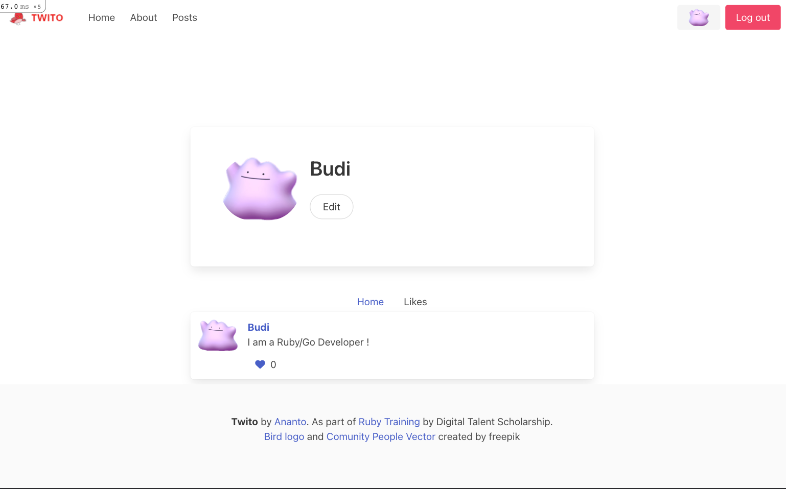

# TWITO

twit to gather (twito) is a project from Ruby training held by Digital Talent Scholarship

## Requirement

- Ruby 2.7.6
- Rails 6.1.6.1
- PostgreSQL
- Hosting (Optional)

## How to use

- clone it
- run `bundle install`
- run `rails db:create`
- run `rails db:migrate`
- run `rails db:seed`
- open `http://localhost:3000/`
- login with username `budi@example.com` and password `123`

## Troubleshooting

### Cross Platform

I have problem during installation this repo that I build on my Mac to Linux environment. So I should run `bundle lock --add-platform x86_64-linux` before cloning this repo to production environment. [source](https://calvin.my/posts/add-platform-to-ruby-application)

